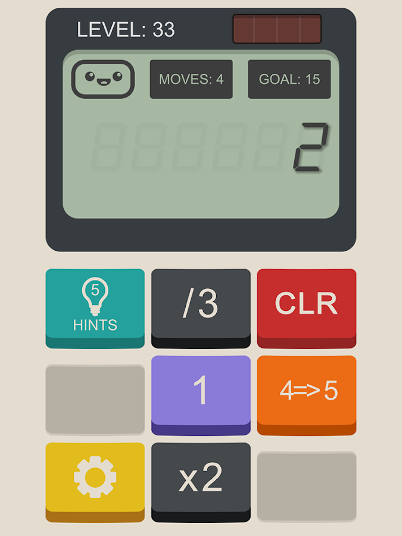

# Calculator Game Solver

A solver for __Calculator: The Game__ by Simple Machine. It supports all 16 rule types. It supports portals. It can solve all 199 levels of the game.

It runs through the terminal. The solver prompts for input about a particular level, and outputs a series of steps to complete the given level. It then prompts the user to complete another level or quit the program. This repeats until the user chooses to quit the program.

This document covers the rules of Calculator: The Game and how to use the program. For installation instructions, see [the usage docs](./docs/usage.md). If you have any issues with the program, feel free to open an issue on the repository.

## The Main Program



In __Calculator: The Game__ the user is presented with a simple challenge: change the calculator's value to the goal value by pressing the buttons. The player is limited to a certain number of moves. The value is displayed in large digits just above the buttons. Each button corresponds to a rule (detailed below) and changes the value in different ways.

A pair of portals may be part of the level. The left portal will be below one digit in the value, and the right portal will be above a different digit. The portals don't move. The digits will "fall into" the left portal and "fall out of" the right portal, adding to the level's value. This behavior is detailed on [the portals docs](docs/portals).

To solve a level, pass in the details through the terminal, and the solution will be printed to standard output.

### Rules

The game has 16 rules, detailed below. The code parentheses wrap placeholder values: replace the placeholder values with digits and leave off the parentheses when giving input to the program.

* Add (`+(op1)`), subtract (`-(op1)`), multiply (`*(op1)`), and divide (`/(op1)`) function as expected
* Pad (`(op1)`) pads `op1` to the right of value. `op1` must be positive
  * 1 pad 2 becomes 12
  * 12 pad 34 becomes 1234
* Sign (`+/-`) changes the sign of `value`
* Delete (`<<`) deletes the rightmost digit of `value`
  * 1234 delete becomes 123
* Convert (`(op1)=>(op2)`, "convert `op1` to `op2`") converts all instances of `op1` to `op2`
  * 1234 convert 34 to 89 becomes 1289
* Power (`^(op1)`) raises `value` to the power of `op1`
* Reverse (`Reverse`) reverses the order of the digits in `value`
* Sum (`SUM`) changes `value` into the sum of its digits but preserves the sign of `value`
  * -123 SUM becomes -6 (because 1 + 2 + 3 = 6)
* Shift left (`< Shift`) and shift right (`Shift >`) shift the digits of value one position left or right, respectively
  * 1234 shift left becomes 2341
  * 1234 shift right becomes 4123
* Mirror (`Mirror`) appends the mirrored value to the end of `value`
  * 23 mirror becomes 2332
* Meta Add (`[+](op1)`) adds `op1` to all operands of non-meta rules in the level
* Store (`Store`) is the only rule that can be updated
  * The Store rule cannot be applied until it is updated
  * Upon updating the Store rule, its operand becomes the value of the level
  * Applying the Store rule functions just like applying the Pad rule
  * The Store rule can be updated any number of times, but updating it does decrease the move counter
* Inverse Ten (`Inv10`) converts each digit to its "10-additive inverse"
  * 4 inverse ten becomes 6, because 4 + 6 = 10
  * 123 inverse ten becomes 987, because each digit is evaluated independently

For more detailed rule documentation, see [the rule docs](docs/rules).

### Sample Use Case

```txt
Enter start value: 2
Enter goal value: 5
Enter the number of moves: 3
Enter one rule per line (empty string to mark end of list):
+2
+1

Are there any portals for this game? (y/n): n
Solution:
+1
+2
Solve again (y/n): y
Enter start value: 3002
Enter goal value: 3507
Enter the number of moves: 5
Enter one rule per line (empty string to mark end of list):
7
Shift >

Are there any portals for this game? (y/n): y
Enter the distance from the ones place of the portal on the left: 5
Enter the distance from the ones place of the portal on the right: 0
Solution:
7
Shift >
7
7
7
Solve again (y/n): n
```

To go from 2 to 5 in at most 3 moves using the rules "add 2" and "add 1", a solution is to first add 1, then add 2. Although 3 moves are allowed, only 2 moves are needed. Other solutions exist, but this one is the first one found by the program, so it is the one output.

Let's examine the second part of the above use case (going from 3002 to 3507):

```txt
Start:
     Y
  3002
Y

'7':
     Y
 30027
Y

'Shift >':
     Y
 73002
Y

'7':
     Y
730027
Y

     Y
 30034
Y

'7':
     Y
300347
Y

     Y
   350
Y

'7':
     Y
  3507
Y
```

## Developer Mode

Running the developer mode allows for test cases to be written automatically via a test factory while using the program as normal. For more information, see [Testing: Test Cases](./docs/testing.md#test-cases)

## Roadmap

This program is enough to beat the original game and any custom level. I want to do more.

Eventually, I'd like to:

* Have users play the game
* Add a feature to only display hints on demand
* Generate my own levels and custom rules
* Share levels and rules with friends
* Show detailed instructions
* Present through a good UI (and restrict bad input)

View [the productivity board on Trello](https://trello.com/b/3mBPd4RG/calculator-game-solver).

## Further Documentation

All further documentation is found in the `docs` folder indexed [here](./docs/index.md).
